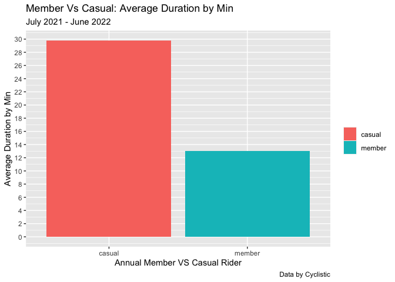
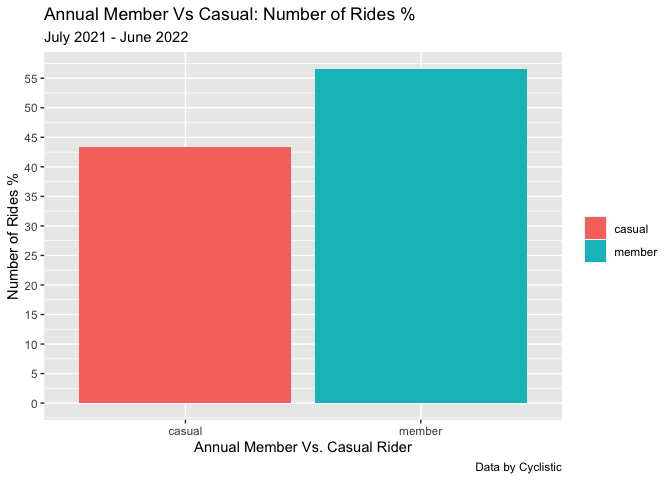
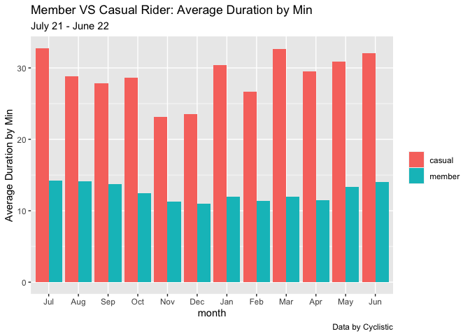
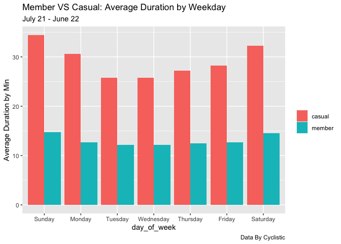
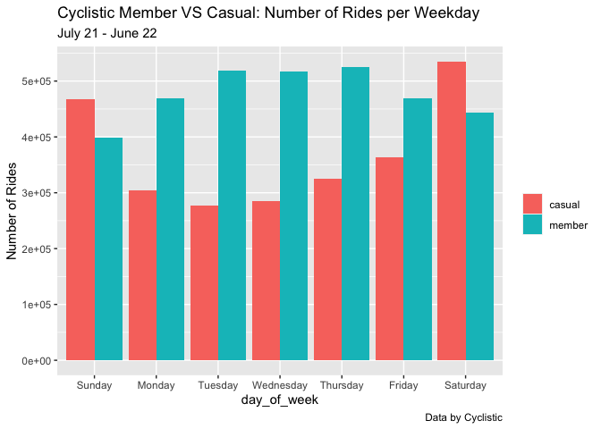
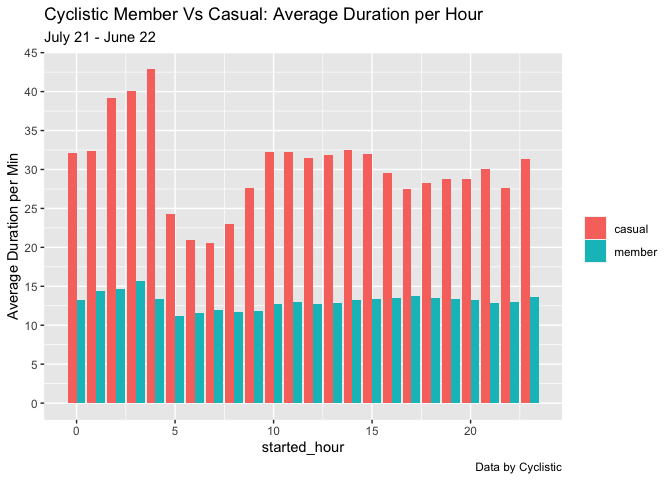
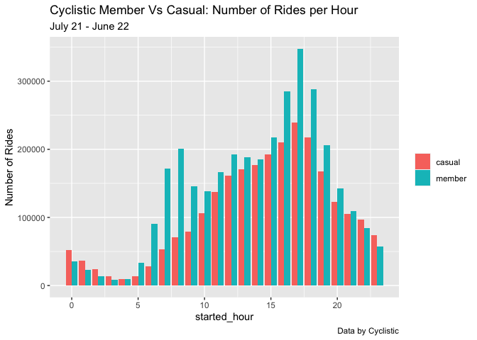

Certificate Capstone Data Study
================
Alyssa McCarthy
2022-10-03

## Scenario

Cyclistic is a fictional bike-share company in Chicago. As a junior data
analyst working with the marketing analyst team, we are trying to help
our manager, the director of marketing, understand how casual riders and
annual members use Cyclistic bikes differently. From there, the team
will design a new marketing strategy to convert casual riders to annual
members. The notoriously detail-oriented executive team has to first
approve our recommendations, so they must be backed with compelling data
insights and visualizations.

### Objectives of analysis

1.  How do annual members and casual riders use Cyclistic bikes
    differently?
2.  Why would casual riders buy Cyclistic annual memberships?
3.  How can Cyclistic use digital media to influence casual riders to
    become members?

##### Deliverable

###### \[X\] A clear statement of business task

Identify how annual members and casual riders use Cyclistic differently.
Maximize the number of annual members with ad campaigns and initiatives
to convert casual riders into annual members.

### Preparing Data

I have downloaded the previous 12 months and stored it locally and it is
organized by month. The data is current and cited. The data is original
and reliable because it comes from the company.

##### Deliverable

###### \[X\] A description of all the data sources used

The data was downloaded from an AWS server and stored locally. It is
data about Cyclistic bike-share company from July 2021 to June 2022

### Processing Data

#### Call the libraries required

``` r
library("tidyverse")
```

    ## ── Attaching packages ─────────────────────────────────────── tidyverse 1.3.2 ──
    ## ✔ ggplot2 3.3.6     ✔ purrr   0.3.4
    ## ✔ tibble  3.1.8     ✔ dplyr   1.0.9
    ## ✔ tidyr   1.2.0     ✔ stringr 1.4.0
    ## ✔ readr   2.1.2     ✔ forcats 0.5.1
    ## ── Conflicts ────────────────────────────────────────── tidyverse_conflicts() ──
    ## ✖ dplyr::filter() masks stats::filter()
    ## ✖ dplyr::lag()    masks stats::lag()

``` r
library("lubridate")
```

    ## 
    ## Attaching package: 'lubridate'
    ## 
    ## The following objects are masked from 'package:base':
    ## 
    ##     date, intersect, setdiff, union

``` r
library("ggplot2")
library("skimr")
library("janitor")
```

    ## 
    ## Attaching package: 'janitor'
    ## 
    ## The following objects are masked from 'package:stats':
    ## 
    ##     chisq.test, fisher.test

``` r
getwd()
```

    ## [1] "/Users/alyssa/Cyclystic-Data-Study/Cyclystic-Data-Study"

``` r
setwd("/Users/alyssa/Desktop/Cyclistic_Trip_Data/CSV")
```

#### Load the data into R

``` r
Month_1<-read.csv("/Users/alyssa/Desktop/Cyclistic_Trip_Data/CSV/202107-divvy-tripdata.csv")
Month_2<-read.csv("/Users/alyssa/Desktop/Cyclistic_Trip_Data/CSV/202108-divvy-tripdata.csv")
Month_3<-read.csv("/Users/alyssa/Desktop/Cyclistic_Trip_Data/CSV/202109-divvy-tripdata.csv")
Month_4<-read.csv("/Users/alyssa/Desktop/Cyclistic_Trip_Data/CSV/202110-divvy-tripdata.csv")
Month_5<-read.csv("/Users/alyssa/Desktop/Cyclistic_Trip_Data/CSV/202111-divvy-tripdata.csv")
Month_6<-read.csv("/Users/alyssa/Desktop/Cyclistic_Trip_Data/CSV/202112-divvy-tripdata.csv")
Month_7<-read.csv("/Users/alyssa/Desktop/Cyclistic_Trip_Data/CSV/202201-divvy-tripdata.csv")
Month_8<-read.csv("/Users/alyssa/Desktop/Cyclistic_Trip_Data/CSV/202202-divvy-tripdata.csv")
Month_9<-read.csv("/Users/alyssa/Desktop/Cyclistic_Trip_Data/CSV/202203-divvy-tripdata.csv")
Month_10<-read.csv("/Users/alyssa/Desktop/Cyclistic_Trip_Data/CSV/202204-divvy-tripdata.csv")
Month_11<-read.csv("/Users/alyssa/Desktop/Cyclistic_Trip_Data/CSV/202205-divvy-tripdata.csv")
Month_12<-read.csv("/Users/alyssa/Desktop/Cyclistic_Trip_Data/CSV/202206-divvy-tripdata.csv")
```

#### Merging the data

We need to first compare the column names of each file to make sure
merging is possible.

``` r
colnames(Month_1)
```

    ##  [1] "ride_id"            "rideable_type"      "started_at"        
    ##  [4] "ended_at"           "start_station_name" "start_station_id"  
    ##  [7] "end_station_name"   "end_station_id"     "start_lat"         
    ## [10] "start_lng"          "end_lat"            "end_lng"           
    ## [13] "member_casual"

``` r
colnames(Month_2)
```

    ##  [1] "ride_id"            "rideable_type"      "started_at"        
    ##  [4] "ended_at"           "start_station_name" "start_station_id"  
    ##  [7] "end_station_name"   "end_station_id"     "start_lat"         
    ## [10] "start_lng"          "end_lat"            "end_lng"           
    ## [13] "member_casual"

``` r
colnames(Month_3)
```

    ##  [1] "ride_id"            "rideable_type"      "started_at"        
    ##  [4] "ended_at"           "start_station_name" "start_station_id"  
    ##  [7] "end_station_name"   "end_station_id"     "start_lat"         
    ## [10] "start_lng"          "end_lat"            "end_lng"           
    ## [13] "member_casual"

``` r
colnames(Month_4)
```

    ##  [1] "ride_id"            "rideable_type"      "started_at"        
    ##  [4] "ended_at"           "start_station_name" "start_station_id"  
    ##  [7] "end_station_name"   "end_station_id"     "start_lat"         
    ## [10] "start_lng"          "end_lat"            "end_lng"           
    ## [13] "member_casual"

``` r
colnames(Month_5)
```

    ##  [1] "ride_id"            "rideable_type"      "started_at"        
    ##  [4] "ended_at"           "start_station_name" "start_station_id"  
    ##  [7] "end_station_name"   "end_station_id"     "start_lat"         
    ## [10] "start_lng"          "end_lat"            "end_lng"           
    ## [13] "member_casual"

``` r
colnames(Month_6)
```

    ##  [1] "ride_id"            "rideable_type"      "started_at"        
    ##  [4] "ended_at"           "start_station_name" "start_station_id"  
    ##  [7] "end_station_name"   "end_station_id"     "start_lat"         
    ## [10] "start_lng"          "end_lat"            "end_lng"           
    ## [13] "member_casual"

``` r
colnames(Month_7)
```

    ##  [1] "ride_id"            "rideable_type"      "started_at"        
    ##  [4] "ended_at"           "start_station_name" "start_station_id"  
    ##  [7] "end_station_name"   "end_station_id"     "start_lat"         
    ## [10] "start_lng"          "end_lat"            "end_lng"           
    ## [13] "member_casual"

``` r
colnames(Month_8)
```

    ##  [1] "ride_id"            "rideable_type"      "started_at"        
    ##  [4] "ended_at"           "start_station_name" "start_station_id"  
    ##  [7] "end_station_name"   "end_station_id"     "start_lat"         
    ## [10] "start_lng"          "end_lat"            "end_lng"           
    ## [13] "member_casual"

``` r
colnames(Month_9)
```

    ##  [1] "ride_id"            "rideable_type"      "started_at"        
    ##  [4] "ended_at"           "start_station_name" "start_station_id"  
    ##  [7] "end_station_name"   "end_station_id"     "start_lat"         
    ## [10] "start_lng"          "end_lat"            "end_lng"           
    ## [13] "member_casual"

``` r
colnames(Month_10)
```

    ##  [1] "ride_id"            "rideable_type"      "started_at"        
    ##  [4] "ended_at"           "start_station_name" "start_station_id"  
    ##  [7] "end_station_name"   "end_station_id"     "start_lat"         
    ## [10] "start_lng"          "end_lat"            "end_lng"           
    ## [13] "member_casual"

``` r
colnames(Month_11)
```

    ##  [1] "ride_id"            "rideable_type"      "started_at"        
    ##  [4] "ended_at"           "start_station_name" "start_station_id"  
    ##  [7] "end_station_name"   "end_station_id"     "start_lat"         
    ## [10] "start_lng"          "end_lat"            "end_lng"           
    ## [13] "member_casual"

``` r
colnames(Month_12)
```

    ##  [1] "ride_id"            "rideable_type"      "started_at"        
    ##  [4] "ended_at"           "start_station_name" "start_station_id"  
    ##  [7] "end_station_name"   "end_station_id"     "start_lat"         
    ## [10] "start_lng"          "end_lat"            "end_lng"           
    ## [13] "member_casual"

#### Now we can merge the individual data frames into one.

``` r
CyclisticFULLYEAR<- rbind(Month_1, Month_2, Month_3, Month_4, Month_5, Month_6, Month_7, Month_8, Month_9, Month_10, Month_11, Month_12)
```

#### Next we can inspect the combined data frame.

``` r
str(CyclisticFULLYEAR)
```

    ## 'data.frame':    5900385 obs. of  13 variables:
    ##  $ ride_id           : chr  "0A1B623926EF4E16" "B2D5583A5A5E76EE" "6F264597DDBF427A" "379B58EAB20E8AA5" ...
    ##  $ rideable_type     : chr  "docked_bike" "classic_bike" "classic_bike" "classic_bike" ...
    ##  $ started_at        : chr  "2021-07-02 14:44:36" "2021-07-07 16:57:42" "2021-07-25 11:30:55" "2021-07-08 22:08:30" ...
    ##  $ ended_at          : chr  "2021-07-02 15:19:58" "2021-07-07 17:16:09" "2021-07-25 11:48:45" "2021-07-08 22:23:32" ...
    ##  $ start_station_name: chr  "Michigan Ave & Washington St" "California Ave & Cortez St" "Wabash Ave & 16th St" "California Ave & Cortez St" ...
    ##  $ start_station_id  : chr  "13001" "17660" "SL-012" "17660" ...
    ##  $ end_station_name  : chr  "Halsted St & North Branch St" "Wood St & Hubbard St" "Rush St & Hubbard St" "Carpenter St & Huron St" ...
    ##  $ end_station_id    : chr  "KA1504000117" "13432" "KA1503000044" "13196" ...
    ##  $ start_lat         : num  41.9 41.9 41.9 41.9 41.9 ...
    ##  $ start_lng         : num  -87.6 -87.7 -87.6 -87.7 -87.7 ...
    ##  $ end_lat           : num  41.9 41.9 41.9 41.9 41.9 ...
    ##  $ end_lng           : num  -87.6 -87.7 -87.6 -87.7 -87.7 ...
    ##  $ member_casual     : chr  "casual" "casual" "member" "member" ...

``` r
nrow(CyclisticFULLYEAR)
```

    ## [1] 5900385

``` r
summary(CyclisticFULLYEAR)
```

    ##    ride_id          rideable_type       started_at          ended_at        
    ##  Length:5900385     Length:5900385     Length:5900385     Length:5900385    
    ##  Class :character   Class :character   Class :character   Class :character  
    ##  Mode  :character   Mode  :character   Mode  :character   Mode  :character  
    ##                                                                             
    ##                                                                             
    ##                                                                             
    ##                                                                             
    ##  start_station_name start_station_id   end_station_name   end_station_id    
    ##  Length:5900385     Length:5900385     Length:5900385     Length:5900385    
    ##  Class :character   Class :character   Class :character   Class :character  
    ##  Mode  :character   Mode  :character   Mode  :character   Mode  :character  
    ##                                                                             
    ##                                                                             
    ##                                                                             
    ##                                                                             
    ##    start_lat       start_lng         end_lat         end_lng      
    ##  Min.   :41.64   Min.   :-87.84   Min.   :41.39   Min.   :-88.97  
    ##  1st Qu.:41.88   1st Qu.:-87.66   1st Qu.:41.88   1st Qu.:-87.66  
    ##  Median :41.90   Median :-87.64   Median :41.90   Median :-87.64  
    ##  Mean   :41.90   Mean   :-87.65   Mean   :41.90   Mean   :-87.65  
    ##  3rd Qu.:41.93   3rd Qu.:-87.63   3rd Qu.:41.93   3rd Qu.:-87.63  
    ##  Max.   :45.64   Max.   :-73.80   Max.   :42.17   Max.   :-87.49  
    ##                                   NA's   :5374    NA's   :5374    
    ##  member_casual     
    ##  Length:5900385    
    ##  Class :character  
    ##  Mode  :character  
    ##                    
    ##                    
    ##                    
    ## 

#### Remove unnecessary data

``` r
CyclisticFULLYEAR$start_station_name <- NULL
CyclisticFULLYEAR$end_station_name <- NULL
```

#### Check if member_casual column contains many observations

``` r
table <- table(CyclisticFULLYEAR$member_casual)
print(table)
```

    ## 
    ##  casual  member 
    ## 2558227 3342158

#### Add columns for start and end hour, start date, end date, month, day

``` r
CyclisticFULLYEAR$started_hour <- lubridate:: hour(CyclisticFULLYEAR$started_at)
CyclisticFULLYEAR$ended_hour <- lubridate:: hour(CyclisticFULLYEAR$ended_at)
CyclisticFULLYEAR$started_date <- as.Date(CyclisticFULLYEAR$started_at)
CyclisticFULLYEAR$ended_date <- as.Date(CyclisticFULLYEAR$ended_at)
CyclisticFULLYEAR$month <-format(as.Date(CyclisticFULLYEAR$started_date), "%b")
CyclisticFULLYEAR$day <- format(as.Date(CyclisticFULLYEAR$started_date), "%d")
CyclisticFULLYEAR$day_of_week <- format(as.Date(CyclisticFULLYEAR$started_date), "%A")
```

#### Add column to calculate the ride duration

``` r
CyclisticFULLYEAR$ride_len <- difftime(CyclisticFULLYEAR$ended_at, CyclisticFULLYEAR$started_at)
```

#### Inspect the structure of the columns

``` r
str(CyclisticFULLYEAR)
```

    ## 'data.frame':    5900385 obs. of  19 variables:
    ##  $ ride_id         : chr  "0A1B623926EF4E16" "B2D5583A5A5E76EE" "6F264597DDBF427A" "379B58EAB20E8AA5" ...
    ##  $ rideable_type   : chr  "docked_bike" "classic_bike" "classic_bike" "classic_bike" ...
    ##  $ started_at      : chr  "2021-07-02 14:44:36" "2021-07-07 16:57:42" "2021-07-25 11:30:55" "2021-07-08 22:08:30" ...
    ##  $ ended_at        : chr  "2021-07-02 15:19:58" "2021-07-07 17:16:09" "2021-07-25 11:48:45" "2021-07-08 22:23:32" ...
    ##  $ start_station_id: chr  "13001" "17660" "SL-012" "17660" ...
    ##  $ end_station_id  : chr  "KA1504000117" "13432" "KA1503000044" "13196" ...
    ##  $ start_lat       : num  41.9 41.9 41.9 41.9 41.9 ...
    ##  $ start_lng       : num  -87.6 -87.7 -87.6 -87.7 -87.7 ...
    ##  $ end_lat         : num  41.9 41.9 41.9 41.9 41.9 ...
    ##  $ end_lng         : num  -87.6 -87.7 -87.6 -87.7 -87.7 ...
    ##  $ member_casual   : chr  "casual" "casual" "member" "member" ...
    ##  $ started_hour    : int  14 16 11 22 16 17 16 12 18 21 ...
    ##  $ ended_hour      : int  15 17 11 22 16 17 17 12 18 22 ...
    ##  $ started_date    : Date, format: "2021-07-02" "2021-07-07" ...
    ##  $ ended_date      : Date, format: "2021-07-02" "2021-07-07" ...
    ##  $ month           : chr  "Jul" "Jul" "Jul" "Jul" ...
    ##  $ day             : chr  "02" "07" "25" "08" ...
    ##  $ day_of_week     : chr  "Friday" "Wednesday" "Sunday" "Thursday" ...
    ##  $ ride_len        : 'difftime' num  2122 1107 1070 902 ...
    ##   ..- attr(*, "units")= chr "secs"

``` r
head(CyclisticFULLYEAR)
```

    ##            ride_id rideable_type          started_at            ended_at
    ## 1 0A1B623926EF4E16   docked_bike 2021-07-02 14:44:36 2021-07-02 15:19:58
    ## 2 B2D5583A5A5E76EE  classic_bike 2021-07-07 16:57:42 2021-07-07 17:16:09
    ## 3 6F264597DDBF427A  classic_bike 2021-07-25 11:30:55 2021-07-25 11:48:45
    ## 4 379B58EAB20E8AA5  classic_bike 2021-07-08 22:08:30 2021-07-08 22:23:32
    ## 5 6615C1E4EB08E8FB electric_bike 2021-07-28 16:08:06 2021-07-28 16:27:09
    ## 6 62DC2B32872F9BA8 electric_bike 2021-07-29 17:09:08 2021-07-29 17:15:00
    ##   start_station_id end_station_id start_lat start_lng  end_lat   end_lng
    ## 1            13001   KA1504000117  41.88398 -87.62468 41.89937 -87.64848
    ## 2            17660          13432  41.90036 -87.69670 41.88990 -87.67147
    ## 3           SL-012   KA1503000044  41.86038 -87.62581 41.89017 -87.62619
    ## 4            17660          13196  41.90036 -87.69670 41.89456 -87.65345
    ## 5            17660          13197  41.90035 -87.69668 41.88659 -87.65839
    ## 6            17660          15655  41.90033 -87.69674 41.91389 -87.70513
    ##   member_casual started_hour ended_hour started_date ended_date month day
    ## 1        casual           14         15   2021-07-02 2021-07-02   Jul  02
    ## 2        casual           16         17   2021-07-07 2021-07-07   Jul  07
    ## 3        member           11         11   2021-07-25 2021-07-25   Jul  25
    ## 4        member           22         22   2021-07-08 2021-07-08   Jul  08
    ## 5        casual           16         16   2021-07-28 2021-07-28   Jul  28
    ## 6        casual           17         17   2021-07-29 2021-07-29   Jul  29
    ##   day_of_week  ride_len
    ## 1      Friday 2122 secs
    ## 2   Wednesday 1107 secs
    ## 3      Sunday 1070 secs
    ## 4    Thursday  902 secs
    ## 5   Wednesday 1143 secs
    ## 6    Thursday  352 secs

#### Check if ride_len is numeric and if not convert it to numeric

``` r
is.factor(CyclisticFULLYEAR$ride_len)
```

    ## [1] FALSE

``` r
CyclisticFULLYEAR$ride_len <- as.numeric(as.character(CyclisticFULLYEAR$ride_len))
is.numeric(CyclisticFULLYEAR$ride_len)
```

    ## [1] TRUE

#### Remove the bad data and create a new version

``` r
CyclisticV2 <- CyclisticFULLYEAR[!(CyclisticFULLYEAR$ride_len <= 0 | CyclisticFULLYEAR$member_casual == ""),]
```

#### Inspect the new version of data

``` r
str(CyclisticV2)
```

    ## 'data.frame':    5899739 obs. of  19 variables:
    ##  $ ride_id         : chr  "0A1B623926EF4E16" "B2D5583A5A5E76EE" "6F264597DDBF427A" "379B58EAB20E8AA5" ...
    ##  $ rideable_type   : chr  "docked_bike" "classic_bike" "classic_bike" "classic_bike" ...
    ##  $ started_at      : chr  "2021-07-02 14:44:36" "2021-07-07 16:57:42" "2021-07-25 11:30:55" "2021-07-08 22:08:30" ...
    ##  $ ended_at        : chr  "2021-07-02 15:19:58" "2021-07-07 17:16:09" "2021-07-25 11:48:45" "2021-07-08 22:23:32" ...
    ##  $ start_station_id: chr  "13001" "17660" "SL-012" "17660" ...
    ##  $ end_station_id  : chr  "KA1504000117" "13432" "KA1503000044" "13196" ...
    ##  $ start_lat       : num  41.9 41.9 41.9 41.9 41.9 ...
    ##  $ start_lng       : num  -87.6 -87.7 -87.6 -87.7 -87.7 ...
    ##  $ end_lat         : num  41.9 41.9 41.9 41.9 41.9 ...
    ##  $ end_lng         : num  -87.6 -87.7 -87.6 -87.7 -87.7 ...
    ##  $ member_casual   : chr  "casual" "casual" "member" "member" ...
    ##  $ started_hour    : int  14 16 11 22 16 17 16 12 18 21 ...
    ##  $ ended_hour      : int  15 17 11 22 16 17 17 12 18 22 ...
    ##  $ started_date    : Date, format: "2021-07-02" "2021-07-07" ...
    ##  $ ended_date      : Date, format: "2021-07-02" "2021-07-07" ...
    ##  $ month           : chr  "Jul" "Jul" "Jul" "Jul" ...
    ##  $ day             : chr  "02" "07" "25" "08" ...
    ##  $ day_of_week     : chr  "Friday" "Wednesday" "Sunday" "Thursday" ...
    ##  $ ride_len        : num  2122 1107 1070 902 1143 ...

#### Save result as .CSV

``` r
write.csv(CyclisticV2, file = "/Users/alyssa/Desktop/Cyclistic_Trip_Data/CSV.csv")
```

##### Deliverable

###### \[X\] Documentation of any cleaning or manipulation of data

See above.

### Analyze the data

Generate a summary for the dataset

``` r
summary(CyclisticV2)
```

    ##    ride_id          rideable_type       started_at          ended_at        
    ##  Length:5899739     Length:5899739     Length:5899739     Length:5899739    
    ##  Class :character   Class :character   Class :character   Class :character  
    ##  Mode  :character   Mode  :character   Mode  :character   Mode  :character  
    ##                                                                             
    ##                                                                             
    ##                                                                             
    ##                                                                             
    ##  start_station_id   end_station_id       start_lat       start_lng     
    ##  Length:5899739     Length:5899739     Min.   :41.64   Min.   :-87.84  
    ##  Class :character   Class :character   1st Qu.:41.88   1st Qu.:-87.66  
    ##  Mode  :character   Mode  :character   Median :41.90   Median :-87.64  
    ##                                        Mean   :41.90   Mean   :-87.65  
    ##                                        3rd Qu.:41.93   3rd Qu.:-87.63  
    ##                                        Max.   :45.64   Max.   :-73.80  
    ##                                                                        
    ##     end_lat         end_lng       member_casual       started_hour  
    ##  Min.   :41.39   Min.   :-88.97   Length:5899739     Min.   : 0.00  
    ##  1st Qu.:41.88   1st Qu.:-87.66   Class :character   1st Qu.:11.00  
    ##  Median :41.90   Median :-87.64   Mode  :character   Median :15.00  
    ##  Mean   :41.90   Mean   :-87.65                      Mean   :14.21  
    ##  3rd Qu.:41.93   3rd Qu.:-87.63                      3rd Qu.:18.00  
    ##  Max.   :42.17   Max.   :-87.49                      Max.   :23.00  
    ##  NA's   :5374    NA's   :5374                                       
    ##    ended_hour     started_date          ended_date            month          
    ##  Min.   : 0.00   Min.   :2021-07-01   Min.   :2021-07-01   Length:5899739    
    ##  1st Qu.:11.00   1st Qu.:2021-08-26   1st Qu.:2021-08-26   Class :character  
    ##  Median :15.00   Median :2021-10-27   Median :2021-10-27   Mode  :character  
    ##  Mean   :14.36   Mean   :2021-12-11   Mean   :2021-12-11                     
    ##  3rd Qu.:18.00   3rd Qu.:2022-04-25   3rd Qu.:2022-04-25                     
    ##  Max.   :23.00   Max.   :2022-06-30   Max.   :2022-07-13                     
    ##                                                                              
    ##      day            day_of_week           ride_len      
    ##  Length:5899739     Length:5899739     Min.   :      1  
    ##  Class :character   Class :character   1st Qu.:    377  
    ##  Mode  :character   Mode  :character   Median :    670  
    ##                                        Mean   :   1217  
    ##                                        3rd Qu.:   1212  
    ##                                        Max.   :2946429  
    ## 

#### Analysis on ride length column

A more descriptive analysis is needed for the ride length column

``` r
mean(CyclisticV2$ride_len)
```

    ## [1] 1217.166

``` r
median(CyclisticV2$ride_len)
```

    ## [1] 670

``` r
max(CyclisticV2$ride_len)
```

    ## [1] 2946429

``` r
min(CyclisticV2$ride_len)
```

    ## [1] 1

#### Compare member average ride duration Vs. casual riders ride duration

``` r
average_duration_table <- CyclisticV2 %>%
  group_by(member_casual) %>%
  summarise(average_duration = mean(ride_len)/60, count = length(ride_len))
print(average_duration_table)
```

    ## # A tibble: 2 × 3
    ##   member_casual average_duration   count
    ##   <chr>                    <dbl>   <int>
    ## 1 casual                    29.8 2557887
    ## 2 member                    13.0 3341852

``` r
options(repr.plot.width = 15, repr.plot.height = 7)
ggplot(average_duration_table, aes(x = member_casual, y = average_duration, fill = member_casual)) +
  geom_col() +
  scale_y_continuous(breaks = scales:: breaks_width(2)) +
  labs(x= "Annual Member VS Casual Rider", y= "Average Duration by Min", title = "Member Vs Casual: Average Duration by Min", subtitle = "July 2021 - June 2022", caption = "Data by Cyclistic") + guides(fill=guide_legend(title = NULL))
```

<!-- -->

##### This chart shows that annual members rides have an average duration of 13 minutes. Casual riders have an average ride duration of 30 minutes.

#### Compare and plot members and casual riders number of rides

``` r
num_of_rides_table <- CyclisticV2 %>%
  group_by(member_casual) %>%
  summarise(num_of_rides = length(ride_len), "%" = (length(ride_len)/nrow(CyclisticV2))*100 )
print(num_of_rides_table)
```

    ## # A tibble: 2 × 3
    ##   member_casual num_of_rides   `%`
    ##   <chr>                <int> <dbl>
    ## 1 casual             2557887  43.4
    ## 2 member             3341852  56.6

``` r
options(repr.plot.width = 15, repr.plot.height = 7)
ggplot(num_of_rides_table, aes(x = member_casual, y = `%`, fill = member_casual)) +
  geom_col() +
  scale_y_continuous(breaks = scales:: breaks_width(5)) +
    labs(x= "Annual Member Vs. Casual Rider", y = "Number of Rides %", title = "Annual Member Vs Casual: Number of Rides %", subtitle = "July 2021 - June 2022", caption = "Data by Cyclistic") + guides(fill=guide_legend(title=NULL))
```

<!-- -->

##### This bar chart shows that members make up 57% of rides and casual riders make up 43% of rides.

#### Compare and plot member and casual average ride duration per month

First the arrangement of months should be fixed.

``` r
CyclisticV2$month <- ordered(CyclisticV2$month, levels=c ("Jul", "Aug", "Sep", "Oct", "Nov", "Dec", "Jan", "Feb", "Mar", "Apr", "May", "Jun"))
```

Next summarize the average ride duration per month

``` r
average_duration_month <- CyclisticV2 %>%
  group_by(member_casual, month) %>%
  summarise(average_duration = mean(ride_len)/60, )
```

    ## `summarise()` has grouped output by 'member_casual'. You can override using the
    ## `.groups` argument.

``` r
print(average_duration_month)
```

    ## # A tibble: 24 × 3
    ## # Groups:   member_casual [2]
    ##    member_casual month average_duration
    ##    <chr>         <ord>            <dbl>
    ##  1 casual        Jul               32.8
    ##  2 casual        Aug               28.8
    ##  3 casual        Sep               27.8
    ##  4 casual        Oct               28.7
    ##  5 casual        Nov               23.2
    ##  6 casual        Dec               23.5
    ##  7 casual        Jan               30.4
    ##  8 casual        Feb               26.7
    ##  9 casual        Mar               32.6
    ## 10 casual        Apr               29.5
    ## # … with 14 more rows
    ## # ℹ Use `print(n = ...)` to see more rows

``` r
options(repr.plot.width = 15, repr.plot.height = 7)
ggplot(average_duration_month, aes(x = month, y = average_duration_month$average_duration, fill = average_duration_month$member_casual))+
  geom_col(position = "dodge")+
  scale_y_continuous(breaks = scales:: breaks_width(10), )+
  labs(y = "Average Duration by Min", title = "Member VS Casual Rider: Average Duration by Min", subtitle = "July 21 - June 22", caption = "Data by Cyclistic" ) + guides(fill=guide_legend(title = NULL))
```

<!-- -->

##### This chart shows different features that can help you differentiate between the annual members and casual riders:

1.  Both annual members and casual riders take longer rides during the
    Summer months.
2.  The weather in Chicago definitely affects both members and casual
    riders.
3.  Chicago is a tourist destination and gets the most tourists during
    Summer months: However it appears there are spikes with casual
    riders likely around school breaks (January Winter break & March
    Spring break).

#### Compare and plot average ride duration per weekday for member and casual riders

First we need to fix the arrangement of days

``` r
CyclisticV2$day_of_week <- ordered(CyclisticV2$day_of_week, levels=c("Sunday", "Monday", "Tuesday", "Wednesday", "Thursday", "Friday", "Saturday"))
```

Next, summarize the average ride duration per weekday

``` r
average_duration_weekday <- CyclisticV2 %>%
  group_by(member_casual, day_of_week) %>%
  summarise(average_duration = mean(ride_len)/60, )
```

    ## `summarise()` has grouped output by 'member_casual'. You can override using the
    ## `.groups` argument.

``` r
print(average_duration_weekday)
```

    ## # A tibble: 14 × 3
    ## # Groups:   member_casual [2]
    ##    member_casual day_of_week average_duration
    ##    <chr>         <ord>                  <dbl>
    ##  1 casual        Sunday                  34.5
    ##  2 casual        Monday                  30.6
    ##  3 casual        Tuesday                 25.7
    ##  4 casual        Wednesday               25.7
    ##  5 casual        Thursday                27.2
    ##  6 casual        Friday                  28.3
    ##  7 casual        Saturday                32.2
    ##  8 member        Sunday                  14.7
    ##  9 member        Monday                  12.6
    ## 10 member        Tuesday                 12.2
    ## 11 member        Wednesday               12.2
    ## 12 member        Thursday                12.5
    ## 13 member        Friday                  12.7
    ## 14 member        Saturday                14.5

``` r
options(repr.plot.width = 15, repr.plot.height = 7)
ggplot(average_duration_weekday, aes(x = day_of_week, y = average_duration_weekday$average_duration, fill = average_duration_weekday$member_casual))+
  geom_col(position = "dodge")+
  scale_y_continuous(breaks = scales:: breaks_width(10), )+
  labs(y = "Average Duration by Min", title = "Member VS Casual: Average Duration by Weekday", subtitle = "July 21 - June 22", caption = "Data By Cyclistic" ) + guides(fill=guide_legend(title = NULL))
```

<!-- -->

##### This chart shows that members take roughly the same length trips, indicating they are riding the same route often. It also shows casual riders take longer riders than members and take longer rides on the weekends.

#### Compare and plot member and casual rider number of rides per weekday

``` r
num_of_rides_weekday <- CyclisticV2 %>%
  group_by(member_casual, day_of_week) %>%
  summarise(count = length(ride_len), )
```

    ## `summarise()` has grouped output by 'member_casual'. You can override using the
    ## `.groups` argument.

``` r
print(num_of_rides_weekday)
```

    ## # A tibble: 14 × 3
    ## # Groups:   member_casual [2]
    ##    member_casual day_of_week  count
    ##    <chr>         <ord>        <int>
    ##  1 casual        Sunday      467027
    ##  2 casual        Monday      303967
    ##  3 casual        Tuesday     277738
    ##  4 casual        Wednesday   285450
    ##  5 casual        Thursday    325143
    ##  6 casual        Friday      363065
    ##  7 casual        Saturday    535497
    ##  8 member        Sunday      398881
    ##  9 member        Monday      469011
    ## 10 member        Tuesday     518207
    ## 11 member        Wednesday   516507
    ## 12 member        Thursday    525901
    ## 13 member        Friday      469221
    ## 14 member        Saturday    444124

``` r
options(repr.plot.width = 15, repr.plot.height = 7, scripen=5)
ggplot(num_of_rides_weekday, aes(x = day_of_week, y = count, fill = num_of_rides_weekday$member_casual))+
  geom_col(position = "dodge")+
  scale_y_continuous(breaks = scales:: breaks_width(100000),)+
  labs(y = "Number of Rides", title = "Cyclistic Member VS Casual: Number of Rides per Weekday", subtitle = "July 21 - June 22", caption = "Data by Cyclistic" ) + guides(fill=guide_legend(title=NULL))
```

<!-- -->

##### This chart shows features that can help differentiate between the member and casual riders:

1.  The number of member rides is the greatest during mid-week
2.  Casual riders peak during the weekend

#### Compare and plot member and casual average ride duration

``` r
average_duration_hour <- CyclisticV2 %>%
  group_by(member_casual, started_hour) %>%
  summarise(average_duration = mean(ride_len)/60, )
```

    ## `summarise()` has grouped output by 'member_casual'. You can override using the
    ## `.groups` argument.

``` r
print(average_duration_hour)
```

    ## # A tibble: 48 × 3
    ## # Groups:   member_casual [2]
    ##    member_casual started_hour average_duration
    ##    <chr>                <int>            <dbl>
    ##  1 casual                   0             32.1
    ##  2 casual                   1             32.4
    ##  3 casual                   2             39.1
    ##  4 casual                   3             40.0
    ##  5 casual                   4             43.0
    ##  6 casual                   5             24.3
    ##  7 casual                   6             20.9
    ##  8 casual                   7             20.5
    ##  9 casual                   8             23.0
    ## 10 casual                   9             27.6
    ## # … with 38 more rows
    ## # ℹ Use `print(n = ...)` to see more rows

``` r
options(repr.plot.width = 15, repr.plot.height = 7)
ggplot(average_duration_hour, aes(x = started_hour, y =average_duration_hour$average_duration, fill = average_duration_hour$member_casual))+
  geom_col(position = "dodge")+
  scale_y_continuous(breaks = scales:: breaks_width(5),)+
  labs(y = "Average Duration per Min", title = "Cyclistic Member Vs Casual: Average Duration per Hour", subtitle = "July 21 - June 22", caption = "Data by Cyclistic") + guides(fill=guide_legend(title=NULL))
```

<!-- -->

#### Compare and plot member and casual number of rides per hour

``` r
num_of_rides_hour <- CyclisticV2 %>%
  group_by(member_casual, started_hour) %>%
  summarise(count = length(ride_len), )
```

    ## `summarise()` has grouped output by 'member_casual'. You can override using the
    ## `.groups` argument.

``` r
print(num_of_rides_hour)
```

    ## # A tibble: 48 × 3
    ## # Groups:   member_casual [2]
    ##    member_casual started_hour count
    ##    <chr>                <int> <int>
    ##  1 casual                   0 52223
    ##  2 casual                   1 36503
    ##  3 casual                   2 24186
    ##  4 casual                   3 13741
    ##  5 casual                   4  9755
    ##  6 casual                   5 13579
    ##  7 casual                   6 28466
    ##  8 casual                   7 52875
    ##  9 casual                   8 70379
    ## 10 casual                   9 79312
    ## # … with 38 more rows
    ## # ℹ Use `print(n = ...)` to see more rows

``` r
options(repr.plot.width = 15, repr.plot.height = 7, scipen=5)
ggplot(num_of_rides_hour, aes(x = started_hour, y = num_of_rides_hour$count, fill = num_of_rides_hour$member_casual))+
  geom_col(position = "dodge")+
  scale_y_continuous(breaks = scales:: breaks_width(100000), )+
  labs(y = "Number of Rides", title = "Cyclistic Member Vs Casual: Number of Rides per Hour", subtitle = "July 21 - June 22", caption = "Data by Cyclistic" ) + guides(fill=guide_legend(title = NULL))
```

<!-- -->

##### From this chart we can see the following:

1.  The bigger volume of the chart is between 6:00 AM and 10:00 PM.
2.  Member riders peak at 8:00 AM and at 5:00 PM indicating again that
    they are using bikes to get to and from work.
3.  The peak for casual riders is 5:00 PM. Which may indicate some are
    using it occasionally to get home from work or it may be a result of
    many tourist places (like museums) closing around this time.

##### Deliverable

###### \[X\] A summary of your analysis

Annual Cyclistic members have more rides with a shorter average ride
duration. Members also use Cyclistic bikes more throughout the week
which likely means they are using the bikes to get to and from work.
Casual riders are using the bikes more on the weekends. This likely
means riders are practicing cycling or tourists

### How annual members and casual riders use Cyclistic bikes differently?

1.  Annual members have an average ride duration of 13 minutes while
    casual riders have an average ride length of 30 mintues.
2.  Members make up 57% of rides and casual riders make up 43% of total
    rides.
3.  Casual riders take their longest rides during Summer months as well
    as in January and March, likely because their would be an influx of
    tourists during these times. On the other hand, members had pretty
    steady ride lengths with dips in Winter months likely due to
    Chicago’s weather.
4.  Annual members have a larger volume of rides Monday through Friday.
    Casual riders have the bigger volume of rides on the weekends.
5.  Annual members hit the largest number of rides at 8:00 AM and 5:00
    PM. Casual riders hit a peak number of rides at 5:00 PM.

### What we can conclude from this information?

1.  Annual members are using the bikes to get to and from work.
2.  Casual riders are mostly tourists or people using bikes to exercise
    on the weekend.
3.  The Summer months and big holidays affect the number of casual
    riders.
4.  The weather affects the number of rides for both annual members and
    casual riders.

### Final Deliverable

##### \[X\] Top three recommendations based on the analysis

1.  Increase benefits for riders in the slowest months.
2.  Link a health or biking app that will show riders how they can
    improve their health while using Cyclistic bikes.
3.  Give new annual members benefits if their first ride is longer than
    20 minutes to convert casual riders into annual members.
